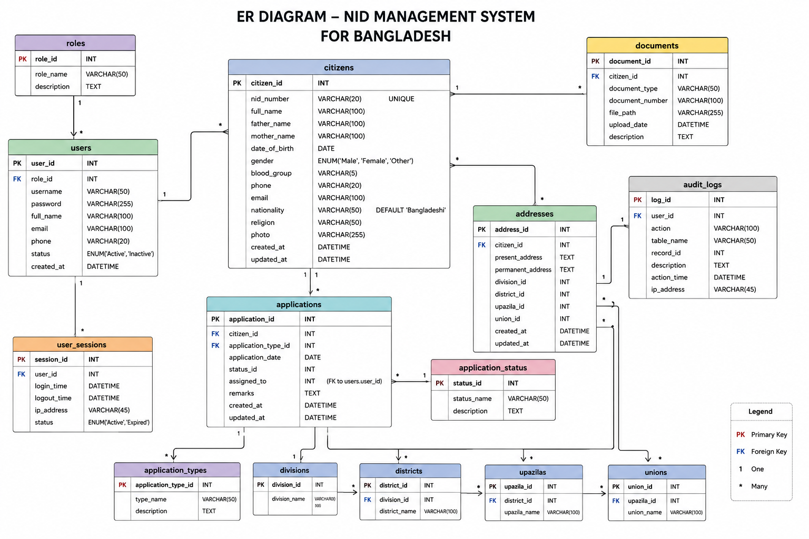

# Software Requirements Specification (SRS)

## Preface

This document provides the Software Requirements Specification (SRS) for the **Desktop-Based NID Management System for Bangladesh**. It defines the system’s functionalities, operational requirements, performance expectations, security measures, and database requirements necessary for development, maintenance, and future improvements.

The purpose of this document is to provide a clear understanding of how the system operates and how users interact with it.

---

## Version History

* **Version 1.0** – Initial Draft.
* **Version 1.1** – Added functional and non-functional requirements.
* **Version 1.2** – Added database requirements, system evolution, and assumptions.

---

# 1. Introduction

## Purpose

The **Desktop-Based NID Management System for Bangladesh** is designed to digitally manage citizen National Identity (NID) information efficiently and securely.

The system enables authorized personnel to create, manage, update, verify, and maintain citizen records while reducing paperwork and manual errors. It also allows users to register, update personal information, and monitor NID application status.

The system aims to improve efficiency, data organization, transparency, and accessibility in identity management.

---

## Document Conventions

This document follows IEEE SRS standards using the following conventions:

* **Must** – Indicates mandatory system requirements.
* **Should** – Indicates recommended system features.
* **May** – Indicates optional enhancements or future improvements.

---

## Intended Audience and Reading Suggestions

### Project Managers & Developers

For understanding system architecture, implementation logic, and software functionality.

### Stakeholders & Administrators

For understanding system goals, operational workflow, and user access management.

### Testers & QA Teams

For verifying whether the system meets the specified requirements.

### Students & Researchers

For understanding project structure, database interaction, and desktop-based management systems.

---

## Scope

The system provides:

* Citizen registration and NID data management
* Secure login and authentication
* NID information storage and retrieval
* Citizen information updates and modification
* Record searching and filtering
* Role-based access management
* Database integration for citizen data storage
* Status tracking and administrative approval process
* Report generation and information viewing

The system is intended to reduce manual paperwork and improve the efficiency of national identity information management.

---

## References

* IEEE Standard 830-1998 (Software Requirements Specification)
* National Identity Registration Concepts
* Database Management System Documentation
* Java Desktop Application Documentation
* Internal Project Requirement Assumptions

---

# 2. Overall Description

## Product Perspective

The **Desktop-Based NID Management System for Bangladesh** is a standalone desktop application designed to maintain citizen identity records digitally.

The system interacts with a relational database for storing and retrieving information. It provides role-based functionalities for administrators and citizens.

The application minimizes manual processing and improves information accuracy through automation.

---

## Product Functions

### User Authentication

* Register new users
* Secure login system
* Password validation
* Role-based access control

### Citizen Information Management

* Create citizen NID profiles
* View citizen information
* Update citizen records
* Delete outdated or invalid records
* Search citizen information

### Administrative Management

* Approve or verify records
* Manage citizen applications
* Monitor system activities
* Update database records

### Search and Filtering

* Search citizens using NID number
* Search by name or other attributes
* Retrieve citizen details quickly

### Database Management

* Store citizen records securely
* Update and synchronize records
* Maintain structured information relationships

### Status Tracking

* Check application or verification status
* Monitor updates and modifications

---

## User Classes and Characteristics

### Admin

Responsibilities:

* Manage citizen records
* Add, edit, update, and remove information
* Approve registrations
* Access all system functionalities
* Monitor user activities

Characteristics:

* Must have technical authorization
* Full system access

### Citizen/User

Responsibilities:

* Register into the system
* Submit information
* View own NID information
* Update limited profile data
* Check registration status

Characteristics:

* Limited system access
* Restricted to personal information

---

## Operating Environment

The system operates in the following environment:

* Desktop-based application
* Supported Operating Systems:
  * Windows
  * Linux
  * MacOS (optional support)

* Programming Language:
  * Java

* GUI Framework:
  * Java Swing

* Database:
  * MySQL

* Development Environment:
  * IDE such as IntelliJ IDEA, NetBeans, or Eclipse

---

## Design and Implementation Constraints

The system must follow the following constraints:

* Database dependency on MySQL
* Internet is not required for local desktop execution
* Authentication must restrict unauthorized access
* Sensitive citizen data must be protected
* System should maintain data consistency

---

## Assumptions and Dependencies

### Assumptions

* Users possess valid system credentials.
* Administrators are authorized personnel.
* Database server is functioning correctly.
* Citizens provide accurate information.

### Dependencies

* Java Runtime Environment (JRE)
* MySQL Database Server
* JDBC database connectivity
* Local machine resources

---

# 3. System Requirements Specification

## Functional Requirements

### User Authentication

* The system must allow users to register.
* The system must allow users to log in securely.
* The system must validate usernames and passwords.
* The system must support password verification.
* The system must implement role-based authentication.

---

### Citizen Registration

* The system must allow citizens to register for NID information.
* The system must store citizen details in the database.
* The system must validate required fields before submission.
* The system must prevent duplicate records when possible.

---

### Citizen Information Management

* The system must allow administrators to:
  * Create records
  * Read records
  * Update records
  * Delete records

* The system must maintain updated citizen information.

---

### Search Functionality

* The system must allow users to search citizen information.
* Search may be performed using:
  * NID number
  * Name
  * Identification details

---

### Status Management

* The system must allow users to check registration status.
* The system must allow administrators to verify or approve records.

---

### Database Management

* The system must securely store citizen information.
* The system must maintain data consistency.
* The system must retrieve information efficiently.

---

### Reporting and Information Viewing

* The system should allow administrators to view reports.
* The system may allow exporting citizen information.

> **Recommendation:**  
> If your project does not currently generate reports, you may either remove this section or implement PDF/CSV export later.

---

## Non-Functional Requirements

### Performance Requirements

* The system should process user requests quickly.
* Database retrieval should be efficient.
* Search results should appear with minimal delay.
* The system should support multiple records without performance degradation.

> **Recommendation:**  
> Since performance metrics are not measurable from assumptions, avoid writing exact numbers (e.g., 500 concurrent users) unless tested.

---

### Security Requirements

* The system must implement authentication mechanisms.
* Sensitive citizen information must be protected.
* Unauthorized access must be restricted.
* Passwords should be securely stored.

> **Recommendation:**  
> If passwords are currently stored in plain text in your database, consider implementing password hashing.

---

### Reliability and Availability

* The system should maintain stable performance.
* The system should prevent data inconsistency.
* Backup mechanisms should be available for recovery.

---

### Usability Requirements

* The system should provide a user-friendly interface.
* Navigation should be simple and understandable.
* Error messages should be meaningful.

---

### Maintainability and Support

* The system should support future updates.
* Modular implementation should be encouraged.
* Database maintenance should be manageable.

---

### Portability

* The system should run on different desktop operating systems.
* The system must support Java-supported environments.

---

# 4. System Models

Since this project only includes an ER diagram, add it here.

### ENTITY-RELATIONSHIP DIAGRAM





```text
images/ER_Diagram.png
```

Example GitHub structure:

```text
project-folder/
│── images/
│   └── ER_Diagram.png
│
└── SRS.md
```

---

# 5. System Evolution

## Assumptions

* Future support for cloud synchronization may be introduced.
* Enhanced citizen verification may be added.
* Improved authentication systems may be integrated.

---

## Expected Changes

* Biometric verification support
* Smart card integration
* Online verification system
* Improved search and filtering
* Advanced reporting system
* Security enhancements

---

# 6. Appendices

## Hardware Requirements

Minimum requirements:

* Processor: Intel Core i3 or equivalent
* RAM: 4 GB minimum
* Storage: 500 MB available space
* Monitor: Standard display

Recommended requirements:

* Processor: Intel Core i5 or above
* RAM: 8 GB
* SSD storage for better performance

---

## Software Requirements

* Java Runtime Environment (JRE)
* MySQL Database Server
* JDBC Connector
* Java IDE (optional for development)

---

## Database Requirements

The system database should:

* Store citizen records securely
* Maintain logical relationships among tables
* Support CRUD operations
* Ensure data consistency and integrity

---

## Future Improvements

The following features may be implemented in future versions:

* Online registration portal
* Mobile application support
* OTP verification
* Biometric authentication
* PDF report generation
* Multi-language support
* Dashboard analytics

---

# Conclusion

The **Desktop-Based NID Management System for Bangladesh** is intended to improve citizen identity management by providing a secure, organized, and efficient digital system for handling NID records.

The system reduces manual work, improves accessibility, minimizes data redundancy, and enhances information management through a structured database-driven approach.
